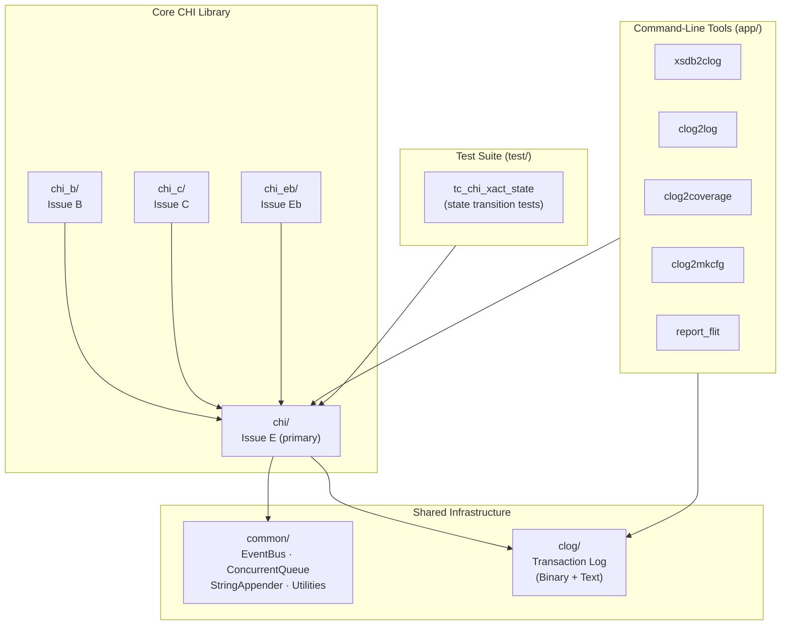
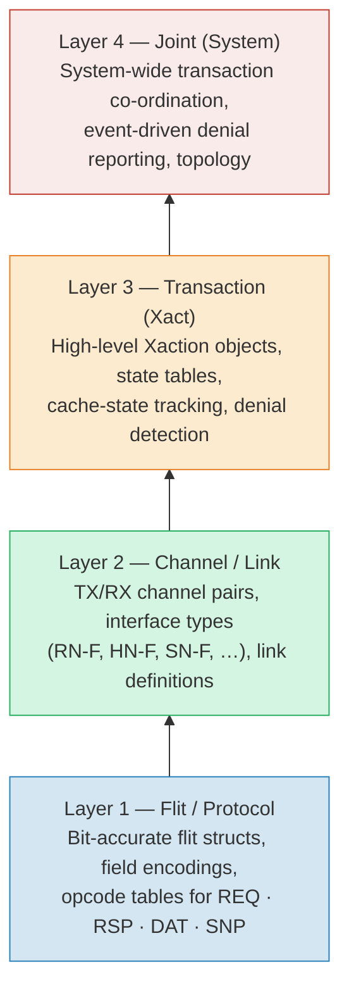
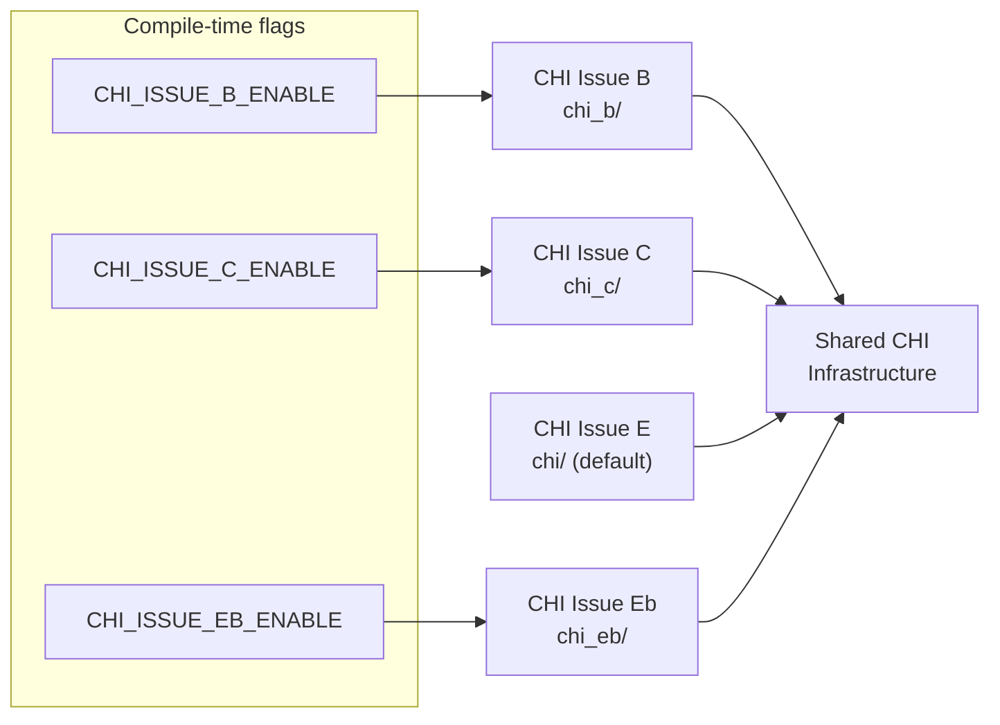
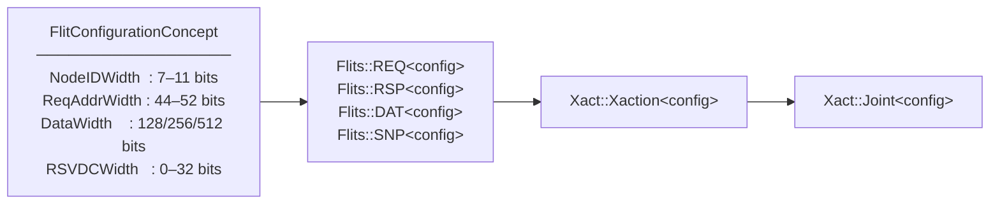

# CHIron Architecture Overview

CHIron is the world's first open-source **AMBA CHI (Coherent Hub Interface) infrastructure library**, providing protocol-level and transaction-level tooling for chip verification, simulation, and analysis. It is a header-only C++20 library used in production by the [OpenXiangShan](https://github.com/OpenXiangShan) project.

---

## Repository Layout

```
CHIron/
├── chi/          Core CHI Issue E implementation
├── chi_b/        CHI Issue B overrides
├── chi_c/        CHI Issue C overrides
├── chi_eb/       CHI Issue Eb overrides
├── clog/         CHI Transaction Log format (binary + text)
├── common/       Shared utilities (EventBus, ConcurrentQueue, …)
├── app/          Command-line analysis tools
├── test/         Transaction-state test suite
├── docs/         ← You are here
├── README.md
└── ERRATA.md
```



---

## Architectural Layers

CHIron is organised as a strict four-layer stack. Higher layers build on lower ones; lower layers have no dependencies on higher layers.



| Layer | Namespace | Key files |
|-------|-----------|-----------|
| Flit / Protocol | `CHI::Flits` | `chi/spec/chi_protocol_flits.hpp`, `chi_protocol_encoding.hpp` |
| Channel / Link | `CHI::Links` | `chi/spec/chi_link_channels.hpp`, `chi_link_interfaces.hpp`, `chi_link_links.hpp` |
| Transaction | `CHI::Xact` | `chi/xact/chi_xactions/`, `chi_xact_state/`, `chi_xact_base/` |
| Joint (System) | `CHI::Xact` | `chi/xact/chi_joint.hpp`, `chi_xact_global.hpp` |

---

## Multi-Issue Support

CHIron uses preprocessor flags to select the active CHI specification issue at compile time. All issue variants share the same namespace and type interfaces.



---

## Key Design Principles

### 1  Header-Only, Template-Parameterised

Every component is a C++20 template parameterised over a `FlitConfigurationConcept`. There are no linkage dependencies between library consumers; the entire library is included by copying headers.



### 2  Compile-Time State Tables

Transaction state-transition tables are generated with `constexpr` / `consteval` at compile time. This eliminates runtime table-build overhead and catches invalid transitions as compiler errors.

### 3  Event-Driven Denial Reporting

The `Joint` coordinator uses the `Gravity::EventBus` to publish denial events when a flit or sequence violates the CHI specification. Subscribers register callbacks and receive strongly-typed denial event objects.

### 4  Zero-Copy Connection Modes

`chi/basic/chi_conn.hpp` exposes two storage strategies for flit references, selectable per component level:

| Mode | Description |
|------|-------------|
| **Inline** | Flit data stored directly — zero heap allocation |
| **Pointer** | Shared pointer to external flit — zero copy |

### 5  Layered Separation of Concerns

Protocol bit-fields, channel wiring, transaction lifecycle, and system-level co-ordination are each handled in a separate, independently testable layer. Higher layers depend on lower layers through narrow, well-defined template interfaces.

---

## Related Guides

| Guide | Description |
|-------|-------------|
| [CHI Protocol Stack](chi-protocol-stack.md) | Nodes, channels, flits, interfaces, and configuration parameters |
| [Transaction Layer](transaction-layer.md) | Transaction types, the Xaction class, Joint, cache-state tracking |
| [CLog & Tools](clog-and-tools.md) | Transaction log formats and command-line analysis tools |
