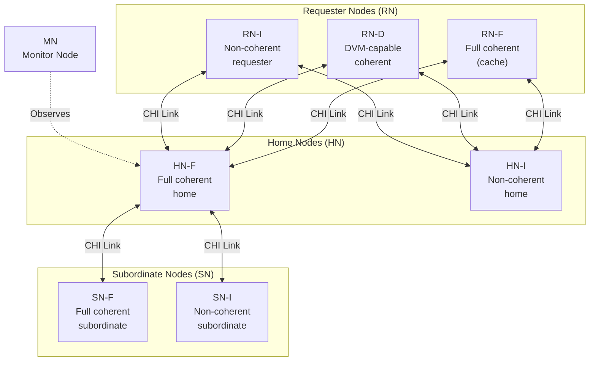
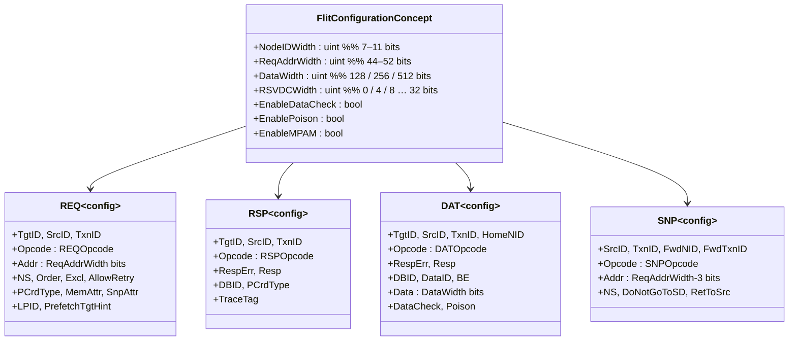
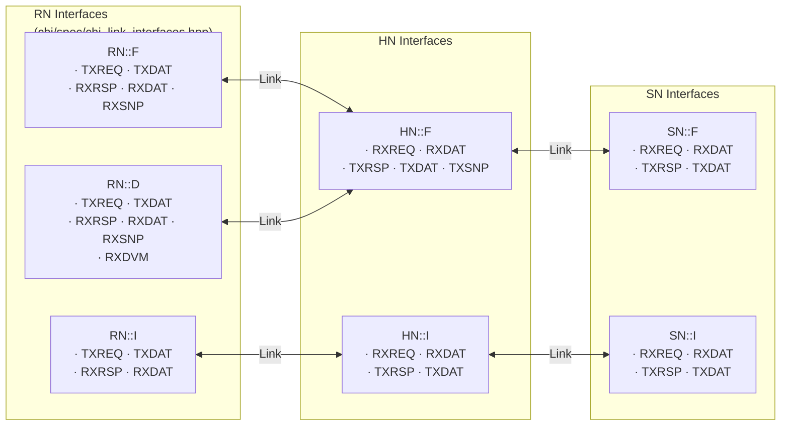
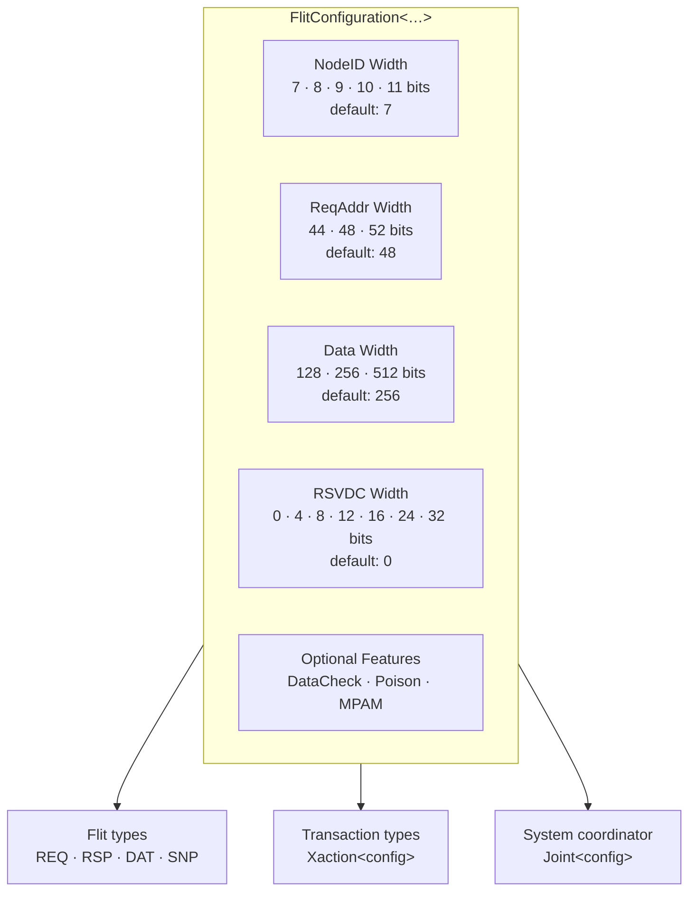
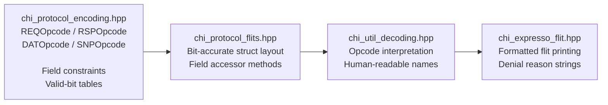

# CHI Protocol Stack

This guide covers the AMBA CHI protocol building blocks as implemented in CHIron: **node types**, **channels**, **flit structures**, **interfaces**, and **compile-time configuration parameters**.

---

## CHI Network Topology

An AMBA CHI interconnect connects three classes of agent through a shared network. CHIron models each agent type and each link.



### Node Type Summary

| Symbol | Full Name | Role |
|--------|-----------|------|
| **RN-F** | Requester Node — Full Coherent | CPU core caches, GPU L1/L2; issues all transaction types; holds cached data |
| **RN-D** | Requester Node — DVM Capable | Coherent requester that also handles Distributed Virtual Memory operations |
| **RN-I** | Requester Node — I/O | DMA engines, PCIe controllers; non-coherent read/write only |
| **HN-F** | Home Node — Full Coherent | Coherence point; arbitrates snoop traffic; interfaces with memory |
| **HN-I** | Home Node — I/O | Routes non-coherent traffic to SN-I |
| **SN-F** | Subordinate Node — Full Coherent | DRAM controller with coherent memory attributes |
| **SN-I** | Subordinate Node — I/O | Peripheral memory, MMIO regions |
| **MN** | Monitor Node | Passive observer; receives a copy of all transactions for debug/trace |

---

## CHI Link and Channels

Every CHI link is a pair of **TX** (transmit) / **RX** (receive) paths, each carrying one of four channel types.

```mermaid
graph LR
    subgraph RN_SIDE["Requester Node Side"]
        TXREQ_RN["TXREQ"]
        TXDAT_RN["TXDAT"]
        RXRSP_RN["RXRSP"]
        RXDAT_RN["RXDAT"]
        RXSNP_RN["RXSNP"]
    end

    subgraph HN_SIDE["Home Node Side"]
        RXREQ_HN["RXREQ"]
        RXDAT_HN["RXDAT"]
        TXRSP_HN["TXRSP"]
        TXDAT_HN["TXDAT"]
        TXSNP_HN["TXSNP"]
    end

    TXREQ_RN -- "REQ flits" --> RXREQ_HN
    TXDAT_RN -- "DAT flits" --> RXDAT_HN
    RXRSP_RN <-- "RSP flits" -- TXRSP_HN
    RXDAT_RN <-- "DAT flits" -- TXDAT_HN
    RXSNP_RN <-- "SNP flits" -- TXSNP_HN
```

### Channel Functions

| Channel | Direction (RN→HN) | Flit Type | Purpose |
|---------|-------------------|-----------|---------|
| **REQ** | RN → HN | `Flits::REQ` | Request initiation (read, write, atomic, dataless, …) |
| **RSP** | HN → RN | `Flits::RSP` | Completion responses, acknowledgements, credits |
| **DAT** | Bidirectional | `Flits::DAT` | Data payloads (CompData, CopyBack, SnpResp with data) |
| **SNP** | HN → RN | `Flits::SNP` | Snoop requests (SnpOnce, SnpUnique, SnpClean, …) |

---

## Flit Types and Fields

CHIron defines four concrete flit classes, all templated on a `FlitConfigurationConcept`.



---

## Interface Definitions

CHIron wraps channel sets into strongly-typed **interface** objects that represent an entire side of a CHI link.



---

## Configuration Parameters

All CHIron components are parameterised by a `FlitConfigurationConcept`. This allows a single codebase to cover every permitted CHI topology configuration.



### Override via Preprocessor

```cpp
// Example: 9-bit NodeID, 48-bit address, 512-bit data bus
#define CHI_NODEID_WIDTH    9
#define CHI_REQ_ADDR_WIDTH  48
#define CHI_DATA_WIDTH      512
#define CHI_ISSUE_EB_ENABLE          // select Issue Eb
#include "chi/chi.hpp"
```

---

## Protocol Encoding

Opcode tables are generated at compile time from `chi/spec/chi_protocol_encoding.hpp` (≈ 3 200 lines). Each flit opcode is a strongly-typed enumeration; the encoding file maps every opcode to its decimal value, permitted field combinations, and specification-mandated constraints.



---

## Related Guides

| Guide | Description |
|-------|-------------|
| [Architecture Overview](architecture-overview.md) | Repository layout, layer model, design principles |
| [Transaction Layer](transaction-layer.md) | Transaction types, Xaction class, Joint coordinator |
| [CLog & Tools](clog-and-tools.md) | Transaction log formats and CLI analysis tools |
