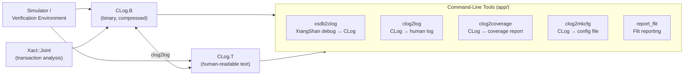
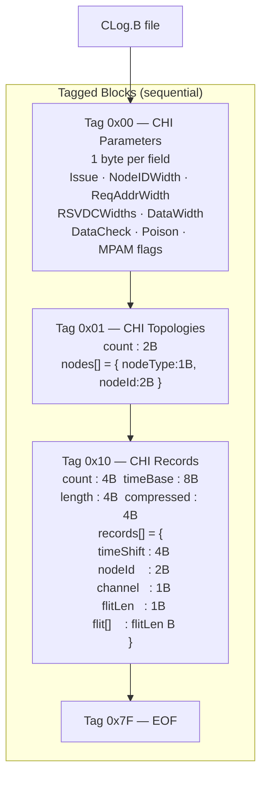
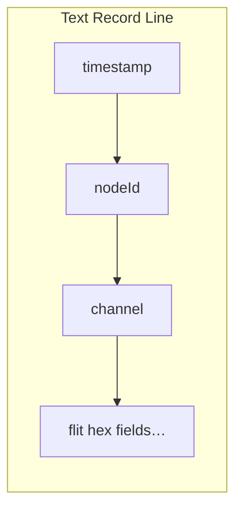
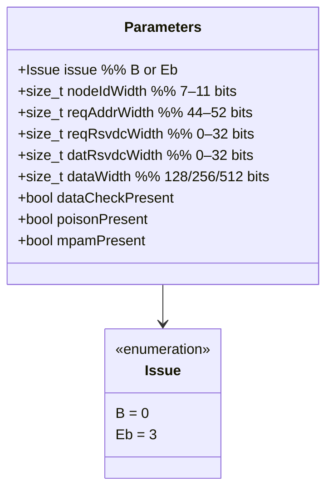
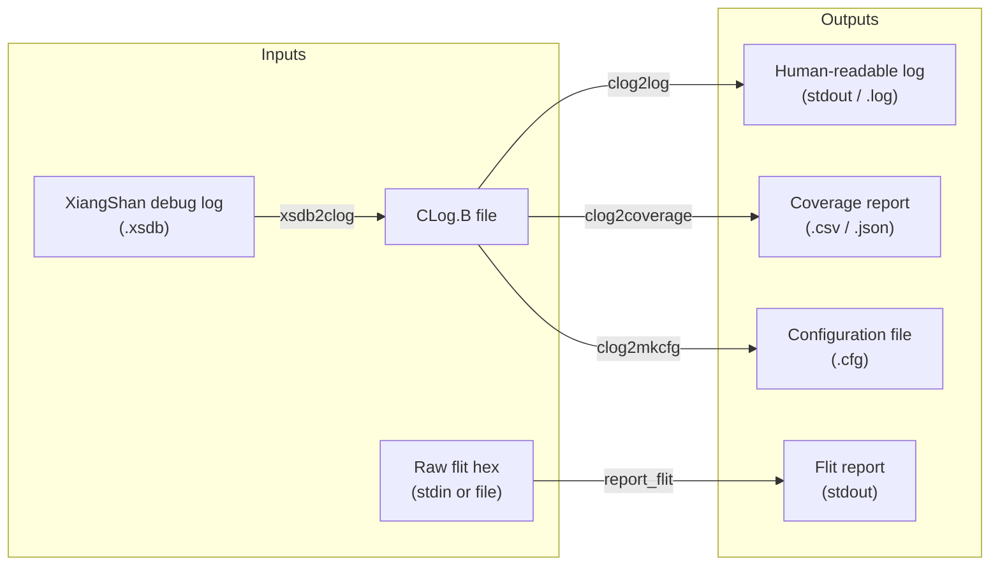

# CLog Format & Command-Line Tools

CHIron records CHI transactions in **CLog** (CHI Transaction Log), a structured format available in both binary (`CLog.B`) and text (`CLog.T`) variants. A suite of CLI tools converts between formats and generates coverage/configuration reports.

---

## CLog Overview



---

## CLog.B — Binary Format

**File:** `clog/clog_b/clog_b.hpp`, `clog_b_tag.hpp`  
**Namespace:** `CLog::CLogB`  
**Dependency:** zlib (optional compression)

### File Structure

A CLog.B file is a sequence of **tagged blocks**. Each block starts with a 1-byte tag type, followed by the block's payload. The file ends with an EOF tag.



### Tag Type Encodings

| Tag byte | Name | Description |
|----------|------|-------------|
| `0x00` | `CHI_PARAMETERS` | Protocol configuration (issue, widths, optional features) |
| `0x01` | `CHI_TOPOS` | Node topology (NodeID → NodeType mapping) |
| `0x10` | `CHI_RECORDS` | Flit records with timestamps (optionally zlib-compressed) |
| `0x7F` | `_EOF` | End-of-file sentinel |

### Record Layout

Each flit record within a `CHI_RECORDS` block:

```
┌──────────────┬──────────┬─────────┬──────────┬────────────────┐
│ timeShift 4B │ nodeId 2B│chan   1B│flitLen 1B│ flit[flitLen]  │
└──────────────┴──────────┴─────────┴──────────┴────────────────┘
```

- **timeShift** — timestamp delta relative to `timeBase` (nanoseconds)
- **nodeId** — originating node (maps to topology)
- **channel** — `TXREQ=0, TXRSP=1, TXDAT=2, TXSNP=3, RXREQ=4, RXRSP=5, RXDAT=6, RXSNP=7`
- **flit** — raw flit bytes (length varies by `DataWidth`)

### SystemVerilog DPI Bindings

`clog/clog_b/clogdpi_b.hpp` and `clogdpi_b.svh` provide DPI-C functions for writing CLog.B records directly from a SystemVerilog simulation:

```systemverilog
import "DPI-C" function void clogdpi_b_open(string filename);
import "DPI-C" function void clogdpi_b_write_req(
    longint time, int nodeId, int channel, ...);
import "DPI-C" function void clogdpi_b_close();
```

---

## CLog.T — Text Format

**File:** `clog/clog_t/clog_t.hpp`, `clog_t_util.hpp`  
**Namespace:** `CLog::CLogT`

CLog.T is a human-readable, line-oriented format. Each line encodes one flit record with space-separated fields, making it easy to inspect with standard Unix tools (`grep`, `awk`, etc.).



### SystemVerilog DPI Bindings

`clog/clog_t/clogdpi_t.hpp` and `clogdpi_t.svh` provide equivalent DPI-C functions for text-format logging:

```systemverilog
import "DPI-C" function void clogdpi_t_open(string filename);
import "DPI-C" function void clogdpi_t_write_flit(
    longint time, int nodeId, string channel, ...);
import "DPI-C" function void clogdpi_t_close();
```

---

## CLog Parameters

Both formats embed a `CLog::Parameters` object describing the exact CHI configuration used during capture. These values are required to correctly decode flit fields.



---

## Command-Line Tools

All tools are built from their respective `app/<tool>/` directories using the provided Makefile.



### Tool Summaries

| Tool | Source | Purpose |
|------|--------|---------|
| **xsdb2clog** | `app/xsdb2clog/` | Converts raw XiangShan XSDB debug output into a CLog.B file |
| **clog2log** | `app/clog2log/` | Decodes a CLog.B file and prints a human-readable transaction log |
| **clog2coverage** | `app/clog2coverage/` | Analyses a CLog.B file and generates a protocol coverage report |
| **clog2mkcfg** | `app/clog2mkcfg/` | Extracts the CHI parameter block from a CLog.B and emits a config file |
| **report_flit** | `app/report_flit/` | Decodes and pretty-prints a raw flit provided on stdin |

### Building the Tools

Each tool has its own `Makefile`. There is a shared `Makefile.config` with common compiler settings.

```bash
# Build clog2log for Issue Eb
cd app/clog2log
make

# Run
./clog2log input.clog > transactions.log
```

---

## CLog Reader API

For programmatic access to CLog.B files, use the callback-based reader in `CLog::CLogB::ReaderWithCallback`:

```cpp
#include "clog/clog_b/clog_b.hpp"

CLog::CLogB::ReaderWithCallback reader;

reader.callbackOnTagCHIParameters = [](const CLog::CLogB::TagCHIParameters& tag) {
    // inspect tag.parameters
};

reader.callbackOnTagCHITopologies = [](const CLog::CLogB::TagCHITopologies& tag) {
    // inspect tag.nodes
};

reader.callbackOnTagCHIRecords = [](const CLog::CLogB::TagCHIRecords& tag) {
    for (auto& rec : tag.records) {
        // rec.timeShift, rec.nodeId, rec.channel, rec.flit
    }
};

std::ifstream f("trace.clog", std::ios::binary);
reader.Read(f);
```

---

## Related Guides

| Guide | Description |
|-------|-------------|
| [Architecture Overview](architecture-overview.md) | Repository layout, layer model, design principles |
| [CHI Protocol Stack](chi-protocol-stack.md) | Nodes, channels, flits, interfaces, configuration parameters |
| [Transaction Layer](transaction-layer.md) | Transaction types, Xaction class, Joint coordinator |
