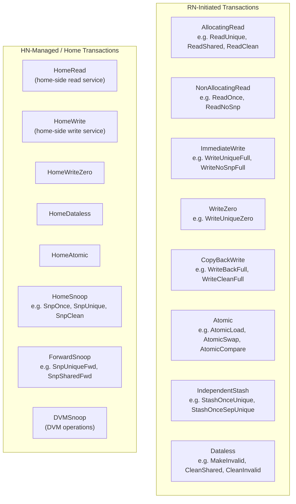
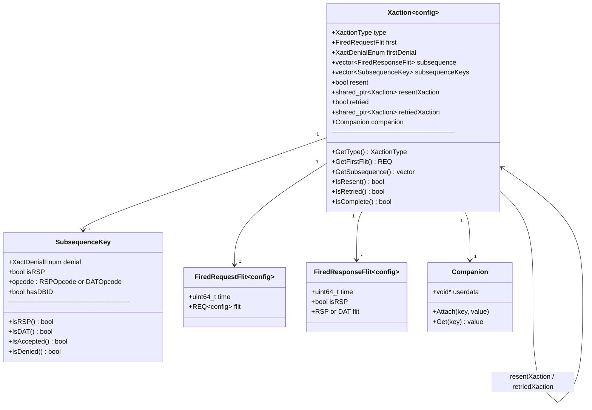
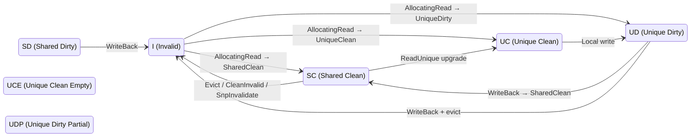
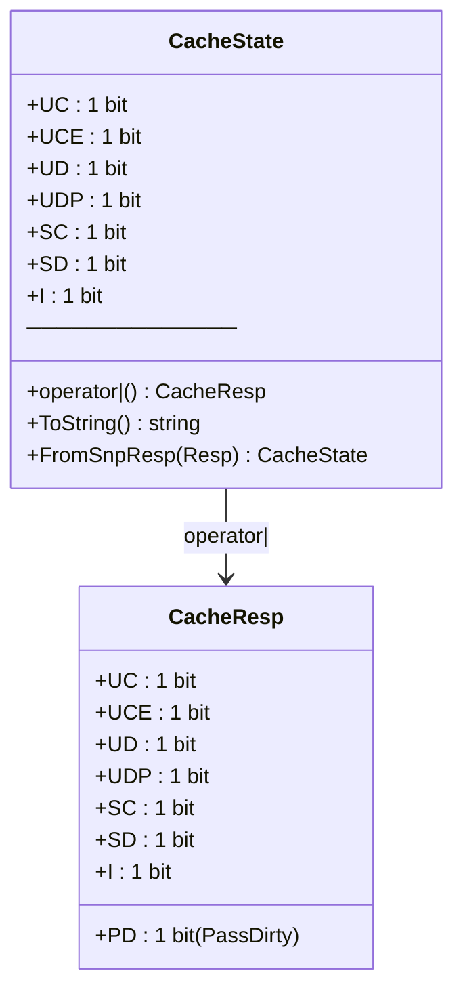
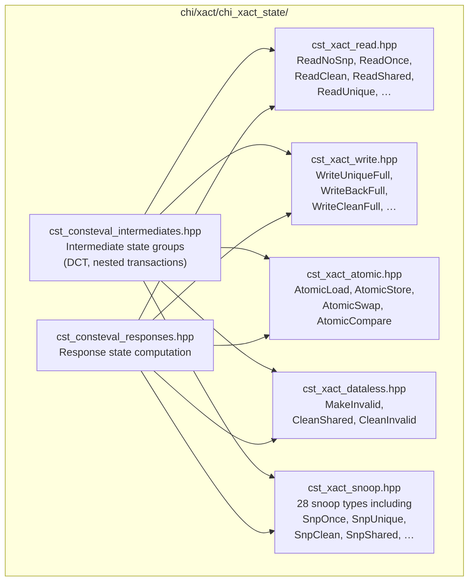
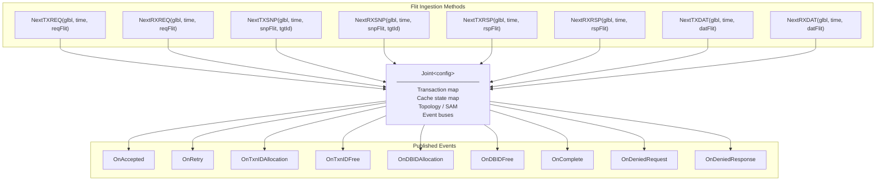
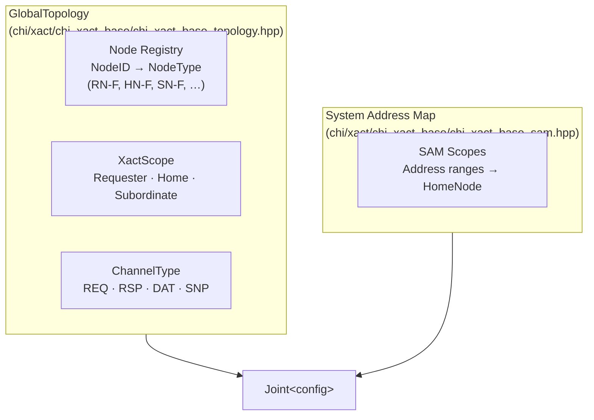
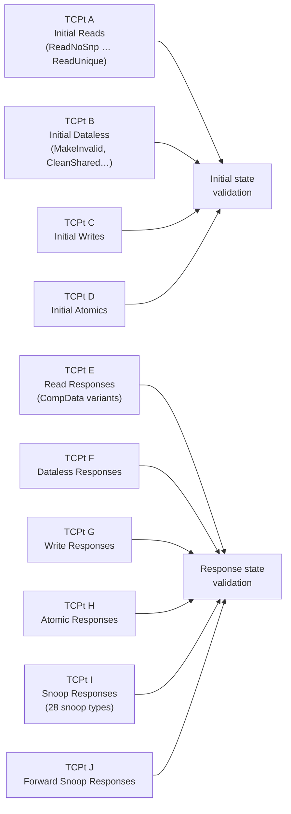

# Transaction Layer

The transaction layer is the highest-level abstraction in CHIron. It groups raw protocol flits into coherent, named **transactions**, tracks cache-coherence state, and reports specification violations through a structured event-driven system.

---

## Transaction Types

CHIron models every CHI transaction category defined in Issue E. Each type is represented by an `XactionType` enum value and a concrete implementation class in `chi/xact/chi_xactions/`.



### Transaction Type Table

| XactionType | Initiator | Data Transfer | Allocates |
|-------------|-----------|---------------|-----------|
| `AllocatingRead` | RN | Home → RN | ✔ |
| `NonAllocatingRead` | RN | Home → RN | ✘ |
| `ImmediateWrite` | RN | RN → Home | ✘ cache |
| `WriteZero` | RN | None (implicit zero) | ✘ |
| `CopyBackWrite` | RN | RN → Home | ✘ |
| `Atomic` | RN | Bidirectional | Optional |
| `IndependentStash` | RN | RN → Home (hint) | Optional |
| `Dataless` | RN | None | ✘ |
| `HomeRead` | HN | Home → SN | Internal |
| `HomeWrite` | HN | SN → Home | Internal |
| `HomeWriteZero` | HN | None | Internal |
| `HomeDataless` | HN | None | Internal |
| `HomeAtomic` | HN | Bidirectional | Internal |
| `HomeSnoop` | HN | Optional | N/A |
| `ForwardSnoop` | HN | RN-to-RN | N/A |
| `DVMSnoop` | MN/HN | None | N/A |

---

## The Xaction Class

Every in-flight CHI transaction is modelled by a `Xaction<config>` object (in `chi/xact/chi_xactions/chi_xactions_base.hpp`).



### Transaction Lifecycle

```mermaid
stateDiagram-v2
    [*] --> Fired : REQ flit observed (NextTXREQ / NextRXREQ)
    Fired --> Accepted : valid request
    Fired --> Denied : protocol violation
    Accepted --> WaitingRetry : AllowRetry=1 and PCrdReturn received
    WaitingRetry --> Resent : RetryAck + PCrdGrant; new REQ flit
    Resent --> InProgress : retry accepted
    Accepted --> InProgress : normal flow
    InProgress --> Complete : CompAck / final RSP or DAT
    InProgress --> Denied : unexpected or invalid response
    Complete --> [*]
    Denied --> [*]
```



---

## Cache State Tracking

`RNCacheStateMap<config>` maintains the per-address cache-line state for every Requester Node visible to the `Joint`.

### Cache States

CHIron encodes the seven CHI cache states as a compact bitset (7 bits, one per state):



### CacheState and CacheResp classes



---

## Compile-Time State Transition Tables

State transitions are computed by `consteval` functions during compilation and stored in read-only tables. There are five major table groups, one per transaction category:



Transition tables are indexed by `(initial_cache_state, opcode)` and return the set of `(valid_response, next_cache_state)` pairs. Invalid transitions are empty sets, detected as protocol violations at runtime.

---

## The Joint Coordinator

`Joint<config>` (in `chi/xact/chi_joint.hpp`) is the top-level system object that ingests individual flits, matches them to transactions, validates sequences, and fires events.



### Joint Return Values

Every `Next*` method returns a `XactDenialEnum`. A value of `XactDenial::None` means the flit was accepted; any other value names the specific specification rule that was violated.

---

## Event-Driven Architecture

CHIron uses a fork of the [Gravity EventBus](../common/eventbus.hpp) that allows hybrid event inheritance. Each event bus is strongly typed — subscribers receive concrete event objects with full context.

```mermaid
classDiagram
    class JointDenialEventBase~config~ {
        +Joint~config~& joint
        +shared_ptr~Xaction~ xaction
        +XactDenialEnum denial
        +JointDenialSource source
        ──────────────────────
        +GetJoint()
        +GetXaction()
        +GetDenial()
    }

    class JointDeniedRequestEvent~config~ {
        +FiredRequestFlit~config~& firedFlit
    }

    class JointDeniedResponseEvent~config~ {
        +FiredResponseFlit~config~& firedFlit
    }

    class JointXactionEventBase~config~ {
        +Joint~config~& joint
        +shared_ptr~Xaction~ xaction
    }

    class JointXactionAcceptedEvent~config~
    class JointXactionRetryEvent~config~
    class JointXactionCompleteEvent~config~
    class JointXactionTxnIDAllocationEvent~config~
    class JointXactionTxnIDFreeEvent~config~
    class JointXactionDBIDAllocationEvent~config~
    class JointXactionDBIDFreeEvent~config~

    JointDenialEventBase~config~ <|-- JointDeniedRequestEvent~config~
    JointDenialEventBase~config~ <|-- JointDeniedResponseEvent~config~
    JointXactionEventBase~config~ <|-- JointXactionAcceptedEvent~config~
    JointXactionEventBase~config~ <|-- JointXactionRetryEvent~config~
    JointXactionEventBase~config~ <|-- JointXactionCompleteEvent~config~
    JointXactionEventBase~config~ <|-- JointXactionTxnIDAllocationEvent~config~
    JointXactionEventBase~config~ <|-- JointXactionTxnIDFreeEvent~config~
    JointXactionEventBase~config~ <|-- JointXactionDBIDAllocationEvent~config~
    JointXactionEventBase~config~ <|-- JointXactionDBIDFreeEvent~config~
```



### Subscribing to Events

```cpp
joint.OnDeniedRequest += [](JointDeniedRequestEvent<cfg>& ev) {
    std::cerr << "Denied: " << ev.GetDenial()->name
              << " on TxnID=" << ev.GetFiredFlit().flit.GetTxnID()
              << "\n";
};

joint.OnComplete += [](JointXactionCompleteEvent<cfg>& ev) {
    // ev.GetXaction() gives the completed Xaction object
};
```

---

## Topology and System Address Map

`GlobalTopology` and `SAM` (System Address Map) give `Joint` the information it needs to validate which node may send which request to which home.



---

## Transaction State Test Suite

`test/tc_chi_xact_state/` validates every cell of the state-transition tables. Tests are grouped into parts:



---

## Related Guides

| Guide | Description |
|-------|-------------|
| [Architecture Overview](architecture-overview.md) | Repository layout, layer model, design principles |
| [CHI Protocol Stack](chi-protocol-stack.md) | Nodes, channels, flits, interfaces, configuration parameters |
| [CLog & Tools](clog-and-tools.md) | Transaction log formats and CLI analysis tools |
